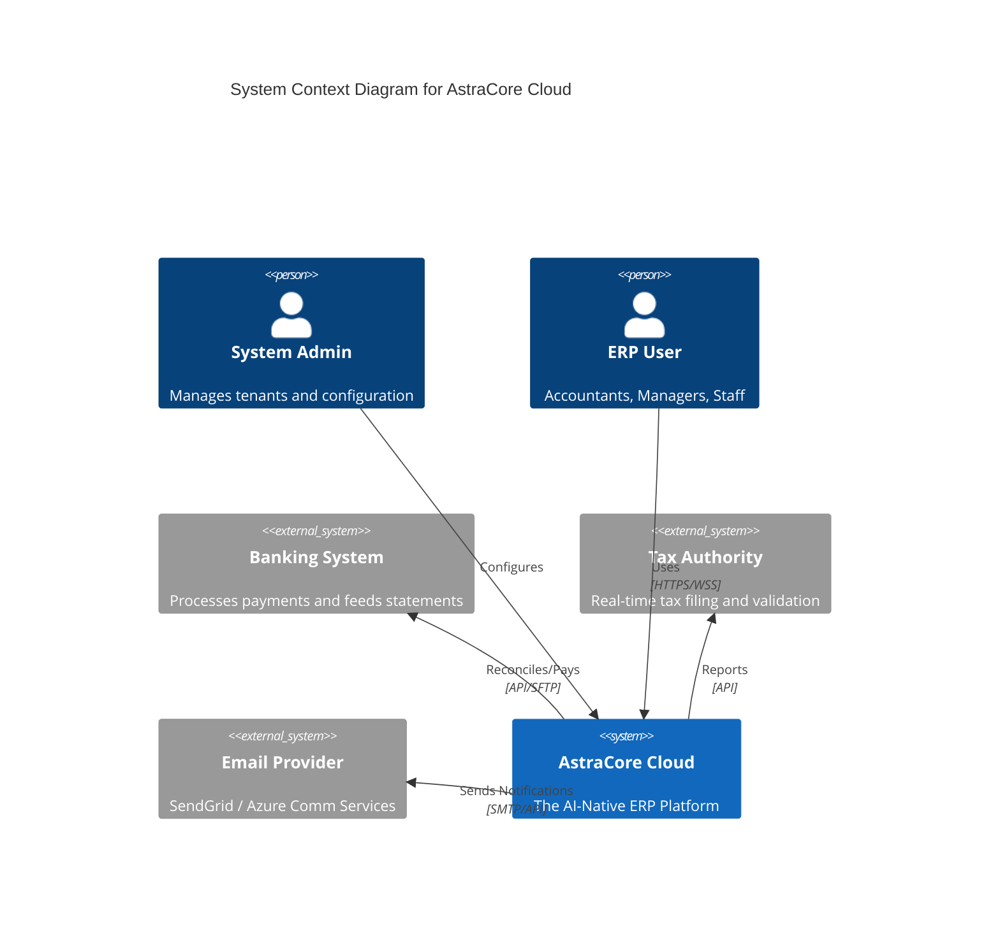
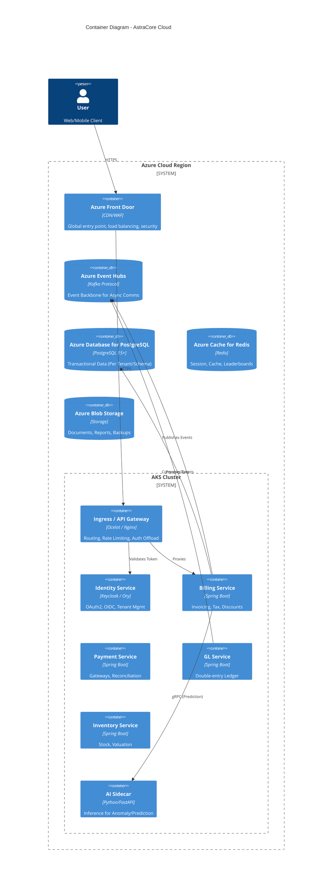

# AstraCore Cloud - Architecture Design

## 1. Executive Summary

AstraCore Cloud is an **AI-Native, Event-Driven ERP** designed for high scalability, real-time financial accuracy, and seamless cloud-native deployment on **Microsoft Azure**. It leverages a **Microservices** architecture with a **Hexagonal** core to ensure domain logic isolation.

## 2. System Context

The system interacts with various external actors and systems:

## 3. High-Level Architecture (Container View)

The platform runs on **Azure Kubernetes Service (AKS)**.

## 4. Core Design Patterns

### 4.1 Hexagonal Architecture (Ports & Adapters)
Every microservice follows this structure to isolate domain logic:
*   **Domain**: Pure Java objects, business rules. No framework dependencies.
*   **Application**: Use Cases, Orchestration.
*   **Infrastructure**: Adapters for Database (JPA), Messaging (Kafka), Web (REST Controllers).

### 4.2 Event-Driven Architecture (EDA)
*   **Choreography** over Orchestration for core flows.
*   **Event Sourcing** (optional for critical audits) / **CQRS** for complex views.
*   **Schema Registry**: Avro/Protobuf for contract evolution.

### 4.3 Multi-Tenancy
*   **Strategy**: Database-per-tenant (logical schemas) or Discriminator column (shared schema) depending on tier.
*   **Isolation**: Strict middleware checks on `Tenant-ID` header.

### 4.4 AI Integration
*   **Sidecar Pattern**: AI models run in a separate container within the same Pod (or close proximity).
*   **Shared Mesh**: For heavy models (LLMs), a centralized AI service mesh is used.
*   **Feedback Loop**: User corrections feed back into training datasets (stored in Data Lake).

## 5. Technology Stack

| Layer | Technology | Azure Service |
| :--- | :--- | :--- |
| **Frontend** | React, Next.js, Tailwind | Azure Static Web Apps |
| **API Gateway** | Spring Cloud Gateway / Ocelot | Azure API Management |
| **Compute** | Java 17+, Spring Boot 3 | Azure Kubernetes Service (AKS) |
| **AI/ML** | Python, PyTorch, ONNX | Azure Machine Learning |
| **Messaging** | Apache Kafka | Azure Event Hubs |
| **Database** | PostgreSQL | Azure Database for PostgreSQL |
| **Caching** | Redis | Azure Cache for Redis |
| **Observability** | OpenTelemetry, Prometheus | Azure Monitor / App Insights |
| **IaC** | Terraform / Bicep | Azure DevOps / GitHub Actions |

## 6. Security Architecture (Zero Trust)

*   **Identity**: Centralized IAM (Keycloak/Entra ID).
*   **mTLS**: Service-to-service communication encryption (via Istio/Linkerd or Spring Security).
*   **Secrets**: No hardcoded secrets. Use **Azure Key Vault** injected via CSI Driver.
*   **Network**: Private Endpoints for all data services. No public IP for DBs.
